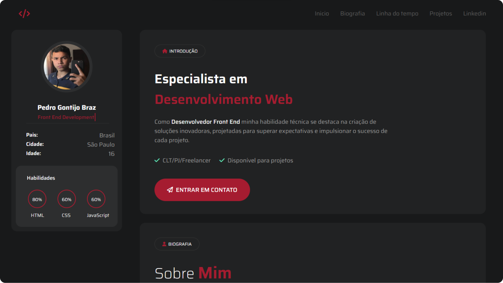

<h1 align="left"> Portfólio </h1>

<b>Portfólio</b> que desenvolvi do zero usando apenas <b>HTML, CSS e JavaScript.</b> 
Mas pretendo futuramente lançar updates e deixa-lo mais complexo. 
Upei ele no Netlify para caso queira ver ele completo: https://meuportfoliopedrogb.netlify.app

 

  

## 🚀 Tecnologias Usadas

Esse projeto foi desenvolvido com as seguintes tecnologias:

- HTML e CSS
- JavaScript
- Git e Github
- Figma

O projeto foi feito no <b>Visual Studio Code.</b>
